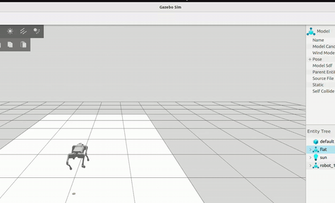
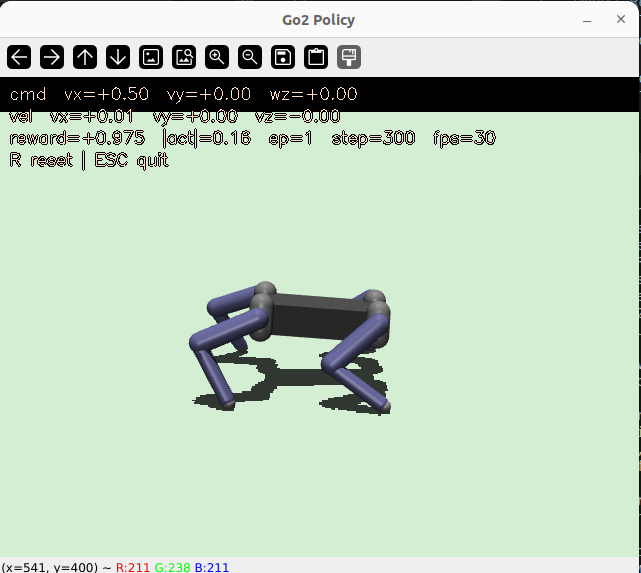

# quadruped-robotics-stack


A ROS2 + Gazebo + MuJoCo workspace for simulating and walking quadruped robots, with three interchangeable locomotion backends and an RL training pipeline built on top.

**What's working right now:**
- **[Quad-SDK](https://github.com/robomechanics/quad-sdk) NMPC** drives a real Unitree Go2 to a commanded goal in Gazebo Harmonic — stands up, plans a path, solves NMPC in real time (~20-30ms/solve), and walks at ~0.7 m/s. See [Quad-SDK (NMPC locomotion)](#quad-sdk-nmpc-locomotion--go2-walks) for the full verified trace.
- **RL locomotion**: a PPO policy trained end-to-end in MuJoCo (domain randomization, curriculum, 8-term reward) learns to walk the Go2 from scratch. See [RL Policy Training](#rl-policy-training).
- **CHAMP** kinematic gait engine for quick, dependency-light walking on the generic reference robot.

**Go2 is the only fully working robot** — real URDF, meshes, and both locomotion backends. The `urdf/{go1,spot,mini_cheetah,mini_pupper,anymal_b,anymal_c}_config/` folders are CHAMP gait/joint-layout config stubs carried over from upstream CHAMP examples: no URDF or mesh files are vendored, each references an external `*_description` ROS1(!) package by `$(find ...)` that isn't included in this repo, so none of them spawn as-is. Treat them as a starting point for wiring up a new robot, not as ready-to-run.




---

## Table of Contents
- [Repository Structure](#repository-structure)
- [System Requirements](#system-requirements)
- [Build ROS2 Packages](#build-ros2-packages)
- [Quick Start](#quick-start)
- [CHAMP Locomotion Simulation](#champ-locomotion-simulation)
- [Locomotion Backends](#locomotion-backends)
- [RL Policy Training](#rl-policy-training)
- [Headless IK Controller](#headless-ik-controller-no-rl)
- [Play Trained Policy](#play-trained-policy-opencv-viewer)
- [Keyboard Teleop](#keyboard-teleop-mujoco-with-rl-policy)
- [Deploy Trained Policy in MuJoCo](#deploy-trained-policy-in-mujoco)
- [Available Robots](#available-robots)
- [Intelligence Modules](#intelligence-modules)
- [Roadmap](#roadmap)
- [References](#references)

---

## Repository Structure

```
quadruped-robotics-stack/
├── urdf/                    # Robot URDF and mesh files
│   ├── go1_config/          # Unitree Go1
│   ├── go2_unitree/         # Unitree Go2 (with DAE meshes)
│   ├── spot_config/         # Boston Dynamics Spot
│   ├── mini_cheetah_config/ # MIT Mini Cheetah
│   ├── mini_pupper_config/  # Mini Pupper
│   ├── anymal_b_config/     # ANYmal B (ETH Zurich)
│   └── anymal_c_config/     # ANYmal C (ETH Zurich)
├── ros2/                    # ROS2 packages (CHAMP framework, ros2 branch)
│   ├── champ/               # Core locomotion controller
│   ├── champ_base/          # Hardware abstraction layer
│   ├── champ_bringup/       # Launch files
│   ├── champ_config/        # Robot-specific configs
│   ├── champ_description/   # URDF loading
│   ├── champ_gazebo/        # Gazebo simulation
│   ├── champ_navigation/    # Navigation stack
│   ├── champ_teleop/        # Keyboard/joystick teleoperation
│   ├── robots/              # Pre-configured robot packages
│   ├── quad_sdk/            # Quad-SDK (CMU) NMPC locomotion backend, Go2-focused
│   └── quad_sdk_external/   # RBDL + IPOPT sources/local build for quad_sdk
├── launch/                  # Top-level launch files
│   ├── view_go2.launch.py   # View Go2 URDF in RViz2
│   ├── gazebo_go2.launch.py # Spawn Go2 in Gazebo Garden
│   ├── gazebo_sim.launch.py # Generic Gazebo sim launcher (CHAMP)
│   ├── rviz_view.launch.py  # Generic RViz2 viewer
│   ├── policy_deploy.launch.py # Deploy trained RL policy (MuJoCo)
│   └── slam_go2.launch.py   # SLAM mapping with 2D LiDAR
├── scripts/                 # Shell scripts for common tasks
│   ├── train_policy.sh      # Train walking policy
│   ├── play_policy.sh       # Visualize trained policy
│   ├── launch_sim.sh        # Launch CHAMP Gazebo sim
│   ├── spawn_go2_gazebo.sh  # Direct Gazebo spawning
│   ├── make_go2_stand.py    # Convert URDF → standing SDF
│   └── gz_pose_to_odom.py   # Ground truth odometry for mapping
├── training/                # RL policy training
│   ├── legged_gym/          # Isaac Gym PPO environments (original)
│   ├── envs/                # MuJoCo + Gazebo Gymnasium environments
│   │   ├── go2_mujoco_env.py   # Go2 MuJoCo env (SB3 PPO)
│   │   ├── go2_gazebo_env.py   # Go2 Gazebo env (ROS2 bridge)
│   │   └── go2_scene.xml       # MuJoCo MJCF scene
│   ├── train_mujoco.py      # MuJoCo training script
│   ├── train_gazebo.py      # Gazebo training script
│   ├── teleop_mujoco.py     # Keyboard teleop in MuJoCo
│   ├── launch/              # ROS2 launch files for Gazebo RL
│   ├── deploy/              # Policy deployment (MuJoCo / real robot)
│   └── setup.py
├── intelligence/            # Higher-level autonomy stack
│   ├── gait/                # Gait scheduler
│   ├── perception/          # Terrain estimator
│   ├── navigation/          # Waypoint navigator (ROS2)
│   ├── terrain/             # Adaptive controller
│   └── llm_commander/       # Natural language → robot commands
├── description/             # Robot description docs and joint conventions
└── interfaces/              # Custom ROS2 msgs, srvs, actions
```

---

## System Requirements

- Ubuntu 22.04
- ROS2 Humble
- Gazebo Harmonic (gz-sim8) — works with `ros_gz_sim`
- Python 3.8+
- NVIDIA GPU with 10GB+ VRAM for RL training

---

## Build ROS2 Packages

```bash
cd ros2
source /opt/ros/humble/setup.bash
colcon build --symlink-install --cmake-args -DBUILD_TESTING=OFF
source install/setup.bash
```

---

## Quick Start

### 1. View Go2 in RViz2

Launch a standalone RViz2 session with the full Go2 mesh and a joint slider GUI:
```bash
source /opt/ros/humble/setup.bash
ros2 launch launch/view_go2.launch.py
```

### 2. Spawn Go2 in Gazebo Garden

**Terminal 1 — Launch simulation**
```bash
source /opt/ros/humble/setup.bash
ros2 launch launch/gazebo_go2.launch.py
```

> **Note:** This starts Gazebo Garden, spawns the Go2, bridges topics to ROS2, and opens RViz2 alongside it.

### Terminal 2 — Control the robot

**Publish a single velocity command:**

```bash
ros2 topic pub /cmd_vel geometry_msgs/msg/Twist \
  "{linear: {x: 0.5, y: 0.0, z: 0.0}, angular: {z: 0.0}}" --once
```

**Drive continuously (stream at 10 Hz):**

```bash
ros2 topic pub /cmd_vel geometry_msgs/msg/Twist \
  "{linear: {x: 0.3}, angular: {z: 0.2}}" --rate 10
```

**Useful commands:**

| Action | Command |
|--------|---------|
| Move forward | `linear.x = 0.3` |
| Move backward | `linear.x = -0.3` |
| Strafe left | `linear.y = 0.2` |
| Turn left | `angular.z = 0.5` |
| Turn right | `angular.z = -0.5` |
| Stop | all zeros |

**Keyboard teleoperation (CHAMP):**

```bash
# In a second terminal (after sourcing both ROS2 and ros2/install/setup.bash)
source /opt/ros/humble/setup.bash
source ros2/install/setup.bash
ros2 launch champ_teleop teleop.launch.py
```

Use arrow keys / WASD to drive.

---

## CHAMP Locomotion Simulation

```bash
source /opt/ros/humble/setup.bash
source ros2/install/setup.bash
ros2 launch ros2/champ_config/launch/gazebo.launch.py
```

Then in a second terminal:

```bash
source /opt/ros/humble/setup.bash
source ros2/install/setup.bash
ros2 launch champ_teleop teleop.launch.py
```

> **Note:** `champ_config` (`joints.yaml`, `links.yaml`, `gait.yaml`) is now
> wired to Go2's real joint/link names (`FL_hip_joint`, `FL_thigh`, ...,
> `nominal_height: 0.32`) and `gazebo.launch.py` points at
> `urdf/go2_unitree/urdf/go2_gz.urdf.xacro` instead of the generic reference
> robot. It still cannot be launched end-to-end in this repo: `champ_gazebo`
> depends on Gazebo Classic (`gazebo_ros`, `gazebo_ros2_control`), which isn't
> installed and is a different physics stack from this repo's Gazebo
> Harmonic/gz-sim8 setup used everywhere else. Bridging CHAMP's gait engine
> into the native gz-sim pipeline (like the Quad-SDK effort controller does)
> instead of `champ_gazebo` would be the next step. The Go2's actual working
> walking controller is the native gz-sim pipeline described under
> [Gazebo backend](#gazebo-backend-gazebo-harmonic-ros2) below
> (`training/launch/gazebo_rl.launch.py`), which uses real Go2 joint names and
> `gz-sim JointPositionController` plugins instead of CHAMP.

---

## Locomotion Backends

Three ways to make the Go2 walk, in increasing order of control sophistication:

| Backend | Approach | Status |
|---------|----------|--------|
| Native gz-sim (`training/launch/gazebo_rl.launch.py`) | RL policy or IK trot, direct `JointPositionController` | Working (see [Gazebo backend](#gazebo-backend-gazebo-harmonic-ros2)) |
| CHAMP (`ros2/champ_config`) | Kinematic gait engine | Wired for CHAMP's generic reference robot only, not Go2 (see note above) |
| **Quad-SDK** (`ros2/quad_sdk`) | NMPC + global/local planner, real Go2 config shipped upstream | **Walking** — verified end-to-end: stands, plans, NMPC converges, Go2 walks to a goal (see below) |

### Quad-SDK (NMPC locomotion) — Go2 walks

[Quad-SDK](https://github.com/robomechanics/quad-sdk) is vendored in `ros2/quad_sdk/`, with RBDL/IPOPT built locally into `ros2/quad_sdk_external/` (no `/usr/local` deps). Go2 stands up, `global_body_planner` plans a path, `local_planner`/`nmpc_controller` solve NMPC in real time (~20-30ms/solve), and the robot walks to a commanded goal at ~0.7 m/s on flat ground — verified numerically (`ground_truth` position/velocity) and visually.

Full porting history, the IPOPT `mumps`-vs-`ma27` fix, and every other bug fixed to get here is in **[docs/quadsdk_notes.md](docs/quadsdk_notes.md)**.

**Easiest way to try it — one command:**

```bash
./scripts/walk_quadsdk_go2.sh                          # flat ground, goal (5, 0)
./scripts/walk_quadsdk_go2.sh 8.0 0.0 gui               # custom goal, with the Gazebo GUI visible
./scripts/walk_quadsdk_go2.sh 5.0 0.0 gui step_20cm.sdf # walk over a terrain world instead of flat ground
```

This launches Gazebo, spawns Go2, holds the stand command for you (a single `--once` publish can be lost to a ROS2 discovery race — this script handles that), and starts the NMPC planner toward the goal.

**Terrain worlds** — actually run headless against every world in `quad_sim_scripts/worlds/` on 2026-07-10, not just assumed to work. Pick a goal before/around the feature, not on top of it:

```bash
# Confirmed working
./scripts/walk_quadsdk_go2.sh 1.0 0.0 gui step_20cm.sdf
./scripts/walk_quadsdk_go2.sh 15.0 0.0 gui big_flat.sdf   # flat.sdf's mesh only spans ~5m; use this beyond that

# Solve without crashing, but front-leg motor effort hits ~2x the 33.5 Nm torque
# limit repeatedly — fine in sim, would overcurrent on real hardware
./scripts/walk_quadsdk_go2.sh 1.0 0.0 gui step_25cm.sdf
./scripts/walk_quadsdk_go2.sh 1.0 0.0 gui step_30cm.sdf

# global_body_planner_node segfaults (exit -11) on these — do not expect these to work
./scripts/walk_quadsdk_go2.sh 1.0 0.0 gui gap_80cm.sdf
./scripts/walk_quadsdk_go2.sh 1.0 0.0 gui slope_20_hole.sdf
./scripts/walk_quadsdk_go2.sh 1.0 0.0 gui rough_40cm_huge.sdf
./scripts/walk_quadsdk_go2.sh 1.0 0.0 gui parkour_local_min.sdf
./scripts/walk_quadsdk_go2.sh 1.0 0.0 gui gap_40cm_local_min.sdf
./scripts/walk_quadsdk_go2.sh 1.0 0.0 gui step_10cm_local_min.sdf   # robot also falls through the mesh
./scripts/walk_quadsdk_go2.sh 1.0 0.0 gui step_15cm_local_min.sdf   # robot also falls through the mesh

# Not re-tested this pass, treat as unverified either way
./scripts/walk_quadsdk_go2.sh 1.0 0.0 gui step_10cm.sdf
./scripts/walk_quadsdk_go2.sh 1.0 0.0 gui gap_20cm.sdf
./scripts/walk_quadsdk_go2.sh 1.0 0.0 gui gap_40cm.sdf
./scripts/walk_quadsdk_go2.sh 1.0 0.0 gui slope_20.sdf
./scripts/walk_quadsdk_go2.sh 1.0 0.0 gui rough_25cm.sdf
```

Full test notes (including whether this is a real terrain bug vs. an artifact of running many sims back to back) in [docs/quadsdk_notes.md](docs/quadsdk_notes.md#terrain-test-results).

Useful smoke test (just the sim, no walking, for quick sanity checks):

```bash
timeout 45 bash -c '
source /opt/ros/humble/setup.bash
source ros2/install/setup.bash
source ros2/quad_sdk_external/setup_env.sh
ros2 launch quad_utils quad_gazebo.py gui:=false rviz:=false
' | tail -220
```

Expected today: Go2 spawns, `robot_driver` logs `State estimator disabled (estimator_id='none')`, and Gazebo logs `QuadSimEffortController listening on '/robot_1/control/joint_command'`. You should not see the old `libgz_ros2_control-system.so` / `GzPluginHook` failure.

**One-time setup** (three steps, in order):

```bash
# 1. System packages (needs YOUR sudo password — run this yourself, not via an agent)
./scripts/setup_quadsdk_apt_deps.sh

# 2. RBDL + IPOPT, built into ros2/quad_sdk_external/local (no sudo)
./scripts/build_quadsdk_local_libs.sh

# 3. Build the ROS2 workspace — QUADSDK_DEPS_PREFIX auto-detects the local libs
cd ros2
colcon build --symlink-install
source install/setup.bash
cd ..
```

**Run it:**

```bash
# Terminal 1 — Gazebo + Go2
./scripts/launch_quadsdk_go2.sh                  # world defaults to flat.sdf
./scripts/launch_quadsdk_go2.sh step_20cm.sdf     # or any world under quad_sim_scripts/worlds/

# Terminal 2 — planning stack (global/local planner + NMPC) with twist input
source ros2/install/setup.bash
source ros2/quad_sdk_external/setup_env.sh
ros2 launch quad_utils quad_plan.py
```

---

## RL Policy Training

Three backends are supported. Use the unified helper script:

```bash
./scripts/train_policy.sh [backend] [options]
```

### MuJoCo backend (default — no Isaac Gym needed)

Trains directly in MuJoCo using Gymnasium + Stable-Baselines3 PPO. Headless, fast, CUDA-accelerated.

Features enabled by default:
- **Domain randomization** — body mass ±15%, floor friction ±30%, motor kp ±15% each episode
- **Curriculum learning** — command velocity starts slow (0.3 m/s max) and scales to 1.2 m/s as the policy improves
- **Foot contact observations** — 4 touch sensor readings in the 49-dim observation vector
- **Richer reward** — velocity tracking + base height + orientation + foot contact + action smoothness (8 terms)
- **VecNormalize** — running obs + reward normalisation across all parallel envs
- **TensorBoard** — each reward term logged separately under `reward/lin`, `reward/contact`, etc.
- **Tuned PPO** — lr=3e-4, n_steps=2048, n_epochs=10

```bash
# Install deps once
pip install -r requirements.txt

# Train Go2 (default 2M steps, 8 parallel envs)
./scripts/train_policy.sh mujoco

# Custom run
./scripts/train_policy.sh mujoco --timesteps 5000000 --n_envs 16 --cmd 1.0 0.0 0.0

# Resume from checkpoint (VecNormalize stats auto-loaded from checkpoints/ dir)
./scripts/train_policy.sh mujoco --resume training/logs/mujoco/checkpoints/go2_mujoco_500000_steps.zip
```

Smoke-tested end to end (4k steps, 2 envs) — the pipeline trains cleanly and logs all
8 reward terms. On some machines, building the PPO/Adam optimizer makes `torch`
lazily import `triton` (for `torch._dynamo`), and a broken local
triton/CUDA-driver combo can segfault right there. `train_mujoco.py`,
`train_gazebo.py`, `play_policy.py`, and `teleop_mujoco.py` all block that
import (`sys.modules.setdefault("triton", None)`) before pulling in
`stable_baselines3`, since none of them use `torch.compile`.

Output: `training/logs/mujoco/` — checkpoints + `vecnorm_<steps>_steps.pkl` every 50k steps.

```bash
# View reward curves in TensorBoard
tensorboard --logdir training/logs/mujoco
```

### Gazebo backend (Gazebo Harmonic + ROS2)

Trains with real Gazebo Harmonic physics via ROS2 topics. Uses `JointPositionController` plugins for PD control, bridged via `ros_gz_bridge`.

```bash
source /opt/ros/humble/setup.bash
source ros2/install/setup.bash

# Build ROS2 workspace first (once)
cd ros2 && colcon build --symlink-install --cmake-args -DBUILD_TESTING=OFF && cd ..

# Train (auto-launches Gazebo headlessly)
./scripts/train_policy.sh gazebo

# Use an already-running Gazebo (no auto-launch)
./scripts/train_policy.sh gazebo --no-launch

# Launch Gazebo GUI standalone
ros2 launch training/launch/gazebo_rl.launch.py

# Headless mode
ros2 launch training/launch/gazebo_rl.launch.py headless:=true
```

The Gazebo launch starts paused, spawns the Go2, resets it upright, starts
`scripts/stand_go2_gz.py`, then unpauses physics.
This avoids the robot falling onto its back before the joint controllers receive
their first commands.

> **Known issue:** forward walking via `/cmd_vel` is currently unstable —
> the robot repeatedly trips its own fall-detector (base height check in
> `stand_go2_gz.py`) instead of translating, even on flat ground. Standing
> in place and the fall-recovery reset both work correctly; the IK/gait
> logic that turns a commanded speed into leg trajectories needs further
> tuning to produce clean locomotion. Tracked as follow-up work, separate
> from the multi-terrain world below.

#### Multi-terrain world

An alternative world with ramps, a staircase, a rough patch, and scattered
obstacles — for testing gait robustness beyond flat ground:

```bash
ros2 launch training/launch/gazebo_rl.launch.py world:="$(pwd)/training/envs/go2_multi_terrain.sdf"
```

Terrain zones, all offset along +X from the flat origin (the fall-recovery
reset pose is hardcoded to `(0,0,0.32)`, so the origin has to stay flat):

| Zone | X range | Description |
|------|---------|--------------|
| Ramps | 2.5 – 5.5 m | Two lanes (y=-2, y=+2) at 12° and 22° incline |
| Staircase | 8 – 9.5 m | 6 steps, 0.08 m rise x 0.25 m run each |
| Rough patch | 14 – 18 m | 7x7 grid of small boxes with smoothly-varying height (0.02-0.07 m) |
| Obstacles | 20 – 24 m | 10 scattered boxes, jittered position/size/yaw |

The rough patch is generated by `scripts/generate_rough_patch.py` (numpy
box-blur, no external deps) rather than a Gazebo `<heightmap>` — a heightmap
was tried first but crashes Ogre2's shader compiler under this environment's
software/EGL rendering fallback when combined with the Go2's GPU lidar
sensor. Plain box geometry avoids that render path entirely.

For keyboard joint teleop after launch:

```bash
source /opt/ros/humble/setup.bash
source ros2/install/setup.bash
./scripts/teleop_go2_gz.py
```

Nav2 can be started against the CHAMP map/config:

```bash
source /opt/ros/humble/setup.bash
source ros2/install/setup.bash
ros2 launch launch/nav2_go2.launch.py
```

### SLAM and Mapping

To generate a 2D occupancy grid map of the environment using the newly attached LiDAR, you will need to run the SLAM stack and the ground-truth odometry bridge.

**1. Run Ground Truth Odometry**
Gazebo provides absolute pose data, but SLAM requires a valid `odom` topic. Run the pose-to-odometry script to bridge this gap:
```bash
source /opt/ros/humble/setup.bash
source ros2/install/setup.bash
python3 scripts/gz_pose_to_odom.py
```
* **Topics:** Subscribes to `/model/go2/pose` (Gazebo) and publishes to `/odom` (ROS 2), while broadcasting the `odom -> base_link` TF transform.

**2. Launch SLAM Toolbox**
Once odometry is running, start the SLAM toolbox to begin mapping:
```bash
source /opt/ros/humble/setup.bash
source ros2/install/setup.bash
ros2 launch launch/slam_go2.launch.py
```
* **Topics:** Subscribes to `/scan` (from the 360-degree Gazebo LiDAR) and `/tf`. Publishes the 2D occupancy grid to `/map`.

The Gazebo stand/gait node subscribes to `/cmd_vel` and converts velocity
commands into the same Gazebo joint target topics used by teleop. Full autonomous
navigation also needs valid `map -> odom -> base_link` TF and obstacle data such
as `/scan`.

Robot URDF variants:
- `urdf/go2_unitree/urdf/go2.urdf` — base model
- `urdf/go2_unitree/urdf/go2_gz.urdf` — with Gazebo Harmonic joint controllers (for RL training)

### Isaac Gym backend (requires NVIDIA Isaac Gym)

```bash
# Download from https://developer.nvidia.com/isaac-gym
pip install -e training/
./scripts/train_policy.sh isaac go2
./scripts/train_policy.sh isaac go2 --headless
```

**Registered Isaac tasks:** `go2`, `h1`, `h1_2`, `g1`

---

## Headless IK Controller (no RL)

Run the Go2 immediately without a trained policy using a pure IK trot/walk/bound controller.
Gait switches automatically with speed via the `GaitScheduler`:

| Speed (m/s) | Gait   |
|-------------|--------|
| 0 – 0.05    | Stand  |
| 0.05 – 0.4  | Walk   |
| 0.4 – 1.5   | Trot   |
| 1.5 – 2.5   | Canter |
| 2.5 – 4.0   | Bound  |
| 4.0+        | Pronk  |

```bash
pip install -r requirements.txt

# Run interactive viewer
python3 training/headless_control.py

# Record a video
python3 training/headless_control.py --record out.mp4
```

| Key | Action |
|-----|--------|
| W / S | Forward / Backward |
| A / D | Strafe Left / Right |
| Q / E | Yaw Left / Right |
| Space | Stop |
| R | Reset simulation |
| ESC | Quit |

## Play Trained Policy (OpenCV viewer)

Runs a trained checkpoint in the same headless OpenCV viewer as the IK controller.
VecNormalize stats are auto-detected from the checkpoint directory.



> **Known issue:** on `go2_mujoco_final.zip`, commanding `vx=+0.50` produces an actual `vx≈+0.01` (robot stands in place) while reward still reads `+0.975` — near the top of the scale. That points to the velocity-tracking reward term being too weak relative to the alive/orientation/height terms, letting the policy collect near-max reward by standing still instead of walking. `training/envs/go2_mujoco_env.py` now doubles the velocity-tracking weight, tightens its tracking kernel, and adds an explicit stall penalty (`r_stall`) so standing still under a real command can no longer out-earn walking — but this checkpoint predates that change and no retrain has been run against it yet, so treat it as unverified until a fresh policy is trained and re-evaluated.

```bash
# Auto-detect vecnorm stats from the same directory as the model
python3 training/play_policy.py --model training/logs/mujoco/best_model.zip

# Explicit vecnorm path or custom command velocity
python3 training/play_policy.py --model best_model.zip --vecnorm vecnorm_final.pkl --cmd 0.8 0 0

# Record a video
python3 training/play_policy.py --model best_model.zip --record policy_demo.mp4
```

HUD shows: commanded velocity, actual velocity, per-step reward, action magnitude, episode count.

| Key | Action |
|-----|--------|
| R | Reset episode |
| ESC | Quit |

## Keyboard Teleop (MuJoCo, with RL policy)

Control the Go2 interactively with a trained policy or random actions:

```bash
# With trained model
python3 training/teleop_mujoco.py --model training/logs/mujoco/best_model.zip

# Without model (random actions, for testing the sim)
python3 training/teleop_mujoco.py
```

| Key | Action |
|-----|--------|
| W / S | Forward / Backward |
| A / D | Strafe Left / Right |
| Q / E | Yaw Left / Right |
| R | Reset episode |
| ESC | Quit |

---

## Deploy Trained Policy in MuJoCo

```bash
# For H1/H1_2/G1 with pre-trained weights
python3 training/deploy/deploy_mujoco/deploy_mujoco.py h1.yaml

# Via ROS2 launch (Go2)
ros2 launch launch/policy_deploy.launch.py checkpoint:=/path/to/policy.pt task:=go2
```

---

## Available Robots

| Robot | URDF Path | RL Task | Quad-SDK config | Status |
|-------|-----------|---------|------------------|--------|
| Unitree Go2 | `urdf/go2_unitree/urdf/go2.urdf` | `go2` | `ros2/quad_sdk/quad_simulator/go2_description/` | **Working** — real URDF/meshes, NMPC + RL both drive it |
| Unitree H1 | — | `h1`, `h1_2` | — | legged_gym task only, no URDF vendored here |
| Unitree G1 | — | `g1` | — | legged_gym task only, no URDF vendored here |
| Boston Dynamics Spot | `urdf/spot_config/` | — | — | Stub — CHAMP gait config only, no URDF/meshes, references an unvendored ROS1 `spot_description` package |
| MIT Mini Cheetah | `urdf/mini_cheetah_config/` | — | — | Stub — same as above |
| ANYmal B | `urdf/anymal_b_config/` | — | — | Stub — same as above |
| ANYmal C | `urdf/anymal_c_config/` | — | — | Stub — same as above |
| Mini Pupper | `urdf/mini_pupper_config/` | — | — | Stub — same as above |
| Unitree Go1 | `urdf/go1_config/` | — | — | Stub — `config.json`'s `urdf_path` even points at the wrong robot (`yobotics_description`) |

Don't spawn the "Stub" rows expecting them to work — they'll fail on a missing `_description` package. Go2 is the only robot this repo actually walks.

---

## Intelligence Modules

Higher-level autonomy stack built on top of the base simulation and RL policy.

```
intelligence/
├── locomotion_manager.py       # ROS2 node — fuses all modules into one running stack
├── gait/
│   └── gait_scheduler.py       # Auto-select gait (walk/trot/canter/bound) by speed
├── perception/
│   └── terrain_estimator.py    # Classify terrain (flat/slope/stairs/rough) from IMU + foot forces
├── navigation/
│   └── waypoint_navigator.py   # Autonomous waypoint following via pure pursuit (ROS2 node)
├── terrain/
│   └── adaptive_controller.py  # Fuse terrain + gait into safe velocity commands
└── llm_commander/
    └── llm_commander.py        # Natural language -> robot commands via Claude API
```

### Gait Scheduler

Auto-selects the right gait based on commanded speed:

| Speed (m/s) | Gait   | Foot pattern |
|-------------|--------|--------------|
| 0 – 0.05    | Stand  | All feet down |
| 0.05 – 0.4  | Walk   | One foot at a time |
| 0.4 – 1.5   | Trot   | Diagonal pairs (FL+RR, FR+RL) |
| 1.5 – 2.5   | Canter | Three-beat |
| 2.5 – 4.0   | Bound  | Front pair then rear pair |
| 4.0+        | Pronk  | All four feet airborne |

### Terrain Estimator

Classifies terrain from IMU and foot contact forces, outputs recommended speed limit and foot clearance:

```python
from intelligence.perception.terrain_estimator import TerrainEstimator
estimator = TerrainEstimator()
result = estimator.estimate(imu_roll=0.1, imu_pitch=0.05, contacts=[120, 115, 118, 122])
# TerrainEstimate(terrain_type=flat, slope_deg=6.38, recommended_speed_limit=3.0)
```

### Waypoint Navigator (ROS2)

Autonomous point-to-point navigation using pure pursuit. Run directly as a Python node:

```bash
source /opt/ros/humble/setup.bash
python3 intelligence/navigation/waypoint_navigator.py \
    --ros-args -p waypoints:="[2.0,0.0, 2.0,2.0, 0.0,2.0, 0.0,0.0]" \
               -p linear_speed:=0.5
```

### LLM Commander (Natural Language)

Control the robot with plain English using Claude API:

```bash
export ANTHROPIC_API_KEY=your_key
python3 intelligence/llm_commander/llm_commander.py
```

Then publish commands:

```bash
ros2 topic pub /natural_language_cmd std_msgs/msg/String "data: 'trot forward at medium speed'"
ros2 topic pub /natural_language_cmd std_msgs/msg/String "data: 'turn left slowly'"
ros2 topic pub /natural_language_cmd std_msgs/msg/String "data: 'stop'"
```

### Adaptive Controller

Combines terrain estimation + gait scheduling into a single safe command output:

```python
from intelligence.terrain.adaptive_controller import AdaptiveController
ctrl = AdaptiveController()
cmd = ctrl.adapt(desired_speed=1.2, imu_pitch=0.12, contacts=[110,115,108,120])
# AdaptedCommand(linear_x=1.0, gait='trot', terrain='slope', foot_clearance=0.08)
```

### Locomotion Manager (ROS2 node)

Wires all three modules into one running ROS2 node. Subscribes to IMU + foot forces + raw
velocity commands; publishes safe adapted commands and JSON status.

```
/cmd_vel_raw  (Twist)              →┐
/imu          (Imu)                →┤  LocomotionManager  →  /cmd_vel (Twist)
/foot_forces  (Float32MultiArray)  →┘                     →  /locomotion_status (String, JSON)
```

```bash
source /opt/ros/humble/setup.bash
python3 intelligence/locomotion_manager.py

# With custom params
python3 intelligence/locomotion_manager.py --ros-args -p max_speed:=1.2 -p update_rate:=50.0
```

Monitor the adapted output:

```bash
ros2 topic echo /cmd_vel
ros2 topic echo /locomotion_status
```

The `/locomotion_status` JSON payload includes:

```json
{"terrain": "slope", "gait": "trot", "speed": 0.8, "angular": 0.0, "slope_deg": 12.5, "foot_clearance": 0.08}
```

Pipe `WaypointNavigator` → `LocomotionManager` → gait controller for a fully autonomous stack:

```bash
# Terminal 1 — locomotion manager (terrain-aware speed clamping)
python3 intelligence/locomotion_manager.py

# Terminal 2 — waypoint navigator (publishes to /cmd_vel_raw)
python3 intelligence/navigation/waypoint_navigator.py \
    --ros-args -p waypoints:="[2.0,0.0, 2.0,2.0, 0.0,0.0]" \
               -r /cmd_vel:=/cmd_vel_raw
```

---

## Roadmap

What's actually worth doing next, in priority order:

1. **Fix the `global_body_planner_node` segfault on hard terrain.** Crashes on `gap_80cm.sdf`, `slope_20_hole.sdf`, `rough_40cm_huge.sdf`, `parkour_local_min.sdf`, and all `*_local_min.sdf` worlds (see [terrain test results](docs/quadsdk_notes.md#terrain-test-results)) — the actual working terrain set is much smaller than the world files suggest. Likely a null/out-of-range access in the path search when no easy flat path exists near the goal.
2. **Fix the MuJoCo RL policy's reward hack** (see [Play Trained Policy](#play-trained-policy-opencv-viewer)) — it's currently learning to stand still for near-max reward instead of walking. Reweight the velocity-tracking term in `training/envs/go2_mujoco_env.py` before trusting any checkpoint.
3. **Fix `/cmd_vel` walking on the native Gazebo backend** — currently trips its own fall-detector instead of translating (see [Gazebo backend](#gazebo-backend-gazebo-harmonic-ros2)).
4. **Multi-terrain RL is not there yet, and NMPC is the better bet for terrain anyway.** `training/envs/go2_scene.xml` is a flat plane — domain randomization only covers mass/friction/motor gain, not terrain geometry, so the RL policy has never seen a slope, step, or gap and can't generalize to one. Quad-SDK's NMPC is already terrain-aware (`terrainHeightAtPosition`/`terrainNormalAtPosition` reading real grid-map elevation) and is the backend that's actually walking — put multi-terrain effort into fixing #1 above rather than building an RL terrain curriculum. RL would only be worth revisiting for terrain if NMPC turns out to hit a hard ceiling.

---

## References

- [CHAMP Framework](https://github.com/chvmp/champ) — ROS2 locomotion controller
- [Unitree RL Gym](https://github.com/unitreerobotics/unitree_rl_gym) — PPO policy training
- [legged_gym (ETH Zurich)](https://github.com/leggedrobotics/legged_gym) — original RL gym
- [Isaac Lab](https://github.com/isaac-sim/IsaacLab) — modern GPU training framework
