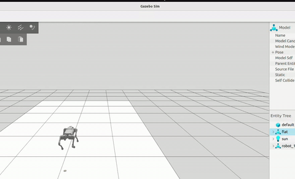
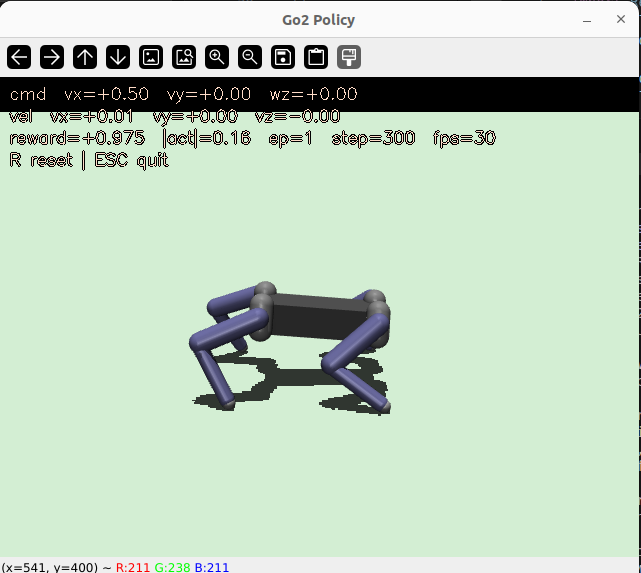
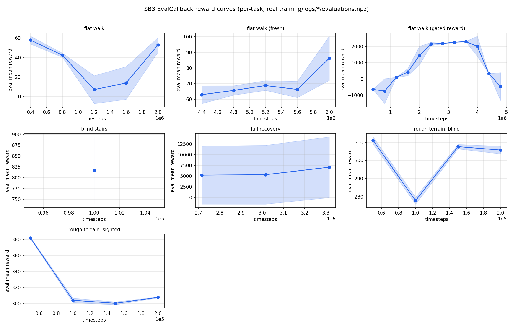
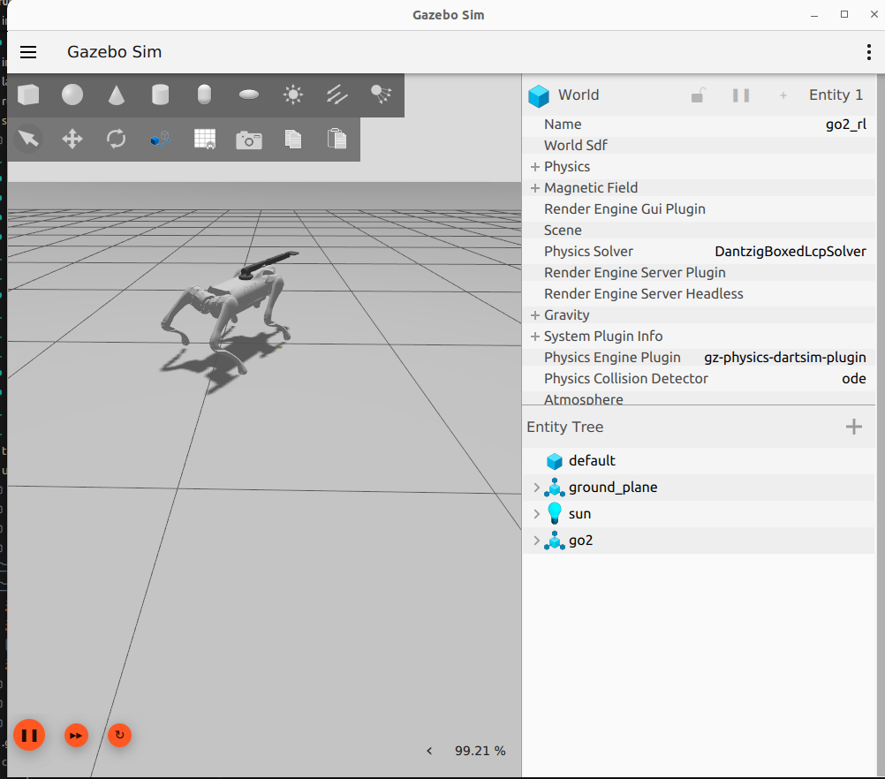

# quadruped-robotics-stack


A ROS2 + Gazebo + MuJoCo workspace for simulating and walking quadruped robots, with three interchangeable locomotion backends (RL, CHAMP, Quad-SDK NMPC) and an RL training pipeline on top.

**What's working:**
- **RL locomotion** — PPO trained end-to-end in MuJoCo (no hand-written gait/IK). Also: blind-vs-sighted rough-terrain comparison, fall recovery, asymmetric critic + staged curriculum, HL navigation. See [RL Policy Training](#rl-policy-training).
- **Quad-SDK NMPC** — a real Unitree Go2 config stands up, plans a path, solves NMPC in real time (~20-30ms/solve), and walks to a goal at ~0.7 m/s. See [Quad-SDK (NMPC locomotion)](#quad-sdk-nmpc-locomotion--go2-walks).
- **CHAMP** — kinematic gait engine, quick dependency-light walking (generic reference robot; not wired to Go2's physics, see note below).
- **Stairs & ledges, indoor autonomy (3D SLAM), arena/warehouse/moving-obstacle worlds** — one-command Gazebo demos.
- **Go2 model weights** — local SB3 `.zip` checkpoints (resumable) + downloadable Isaac/rsl_rl/Genesis `.pt` files. See [docs/PRETRAINED.md](docs/PRETRAINED.md).
- 14 research PDFs under [docs/papers/](docs/papers/README.md).

**Go2 is the only fully working robot** (real URDF/meshes, both locomotion backends). The other `urdf/*_config/` folders are CHAMP config stubs carried over from upstream examples — they reference external ROS1 `*_description` packages that aren't vendored here, so they don't spawn as-is.



---

## Table of Contents
- [Repository Structure](#repository-structure)
- [Setup](#setup)
- [Quick Start](#quick-start)
- [Locomotion Backends](#locomotion-backends)
- [RL Policy Training](#rl-policy-training)
- [Model Policies](#model-policies)
- [SLAM & Autonomy](#slam--autonomy)
- [Available Robots](#available-robots)
- [Manipulator Arm](#manipulator-arm)
- [Intelligence Modules](#intelligence-modules)
- [Roadmap](#roadmap)
- [Additional Docs](#additional-docs)
- [References](#references)

---

## Repository Structure

```
quadruped-robotics-stack/
├── urdf/go2_unitree/        # Unitree Go2 URDF + meshes — fully working
├── ros2/                    # CHAMP + Quad-SDK ROS2 packages
├── launch/                  # Top-level launch files (champ_go2_gazebo, stairs, indoor autonomy, slam3d, nav2, ...)
├── scripts/                 # Train/play/setup helper scripts
├── training/
│   ├── envs/                # Gazebo SDF + MuJoCo XML worlds/scenes
│   ├── terrain/             # Terrain generators
│   ├── pretrained/          # Downloaded .pt weights (gitignored)
│   └── logs/mujoco/         # Local SB3 checkpoints
├── intelligence/            # Gait, perception, navigation, LLM commander
└── docs/                    # DEMOS, PRETRAINED, BENCHMARKS, TROUBLESHOOTING, CHANGELOG, papers/
```

---

## Setup

- Ubuntu 22.04, ROS2 Humble, Gazebo Harmonic (gz-sim8) via `ros_gz_sim`, Python 3.8+
- NVIDIA GPU with 10GB+ VRAM for RL training

```bash
cd ros2
source /opt/ros/humble/setup.bash
colcon build --symlink-install --cmake-args -DBUILD_TESTING=OFF
source install/setup.bash
```

---

## Quick Start

**View Go2 in RViz2:**
```bash
ros2 launch launch/view_go2.launch.py
```

**Spawn Go2 in Gazebo Harmonic + drive with `/cmd_vel`:**
```bash
ros2 launch launch/gazebo_go2.launch.py
ros2 topic pub /cmd_vel geometry_msgs/msg/Twist "{linear: {x: 0.3}, angular: {z: 0.2}}" --rate 10
```
Or keyboard teleop: `ros2 launch champ_teleop teleop.launch.py`.

**Train and run an RL policy (MuJoCo):**
```bash
pip install -r requirements.txt
./scripts/train_policy.sh mujoco --timesteps 2000000
python3 training/play_policy.py --model training/logs/mujoco/go2_mujoco_final.zip --cmd 0.5 0 0
```
See [RL Policy Training](#rl-policy-training) for details.

**Stairs & ledges (CHAMP walk):**
```bash
ros2 launch launch/stairs_ledges_go2.launch.py course:=stairs   # or course:=ledges
```

**Indoor autonomy (room + 3D SLAM):**
```bash
ros2 launch launch/indoor_autonomy_go2.launch.py
```
Full checklist: [docs/DEMOS.md](docs/DEMOS.md).

---

## Locomotion Backends

| Backend | Approach | Status |
|---------|----------|--------|
| Native gz-sim (`training/launch/gazebo_rl.launch.py`) | RL policy or IK trot, direct `JointPositionController` | Working |
| CHAMP, generic robot (`ros2/champ_config`) | Kinematic gait engine | Wired for CHAMP's generic reference robot only, not Go2 — `champ_gazebo` needs Gazebo Classic, this repo runs Gazebo Harmonic |
| CHAMP, Go2 (`launch/champ_go2_gazebo.launch.py`) | Kinematic gait engine, driving the real Go2 URDF via a joint-trajectory adapter, native Gazebo Harmonic | **Working** — default backend for [SLAM & Autonomy](#slam--autonomy) |
| **Quad-SDK** (`ros2/quad_sdk`) | NMPC + global/local planner | **Walking** — verified end-to-end |

Generic-robot CHAMP standalone: `ros2 launch ros2/champ_config/launch/gazebo.launch.py` + `ros2 launch champ_teleop teleop.launch.py` (doesn't fully launch end-to-end on this repo's Gazebo Harmonic setup, see the table above).

### Quad-SDK (NMPC locomotion) — Go2 walks

[Quad-SDK](https://github.com/robomechanics/quad-sdk) is vendored in `ros2/quad_sdk/`, with RBDL/IPOPT built locally into `ros2/quad_sdk_external/`. Full porting history and terrain test results: **[docs/quadsdk_notes.md](docs/quadsdk_notes.md)**.

One-time setup:
```bash
./scripts/setup_quadsdk_apt_deps.sh          # 1. system packages, needs sudo — run yourself
./scripts/build_quadsdk_local_libs.sh        # 2. RBDL + IPOPT, no sudo
cd ros2 && colcon build --symlink-install && source install/setup.bash && cd ..   # 3. build workspace
```

Easiest way to try it:
```bash
./scripts/walk_quadsdk_go2.sh                          # flat ground, goal (5, 0)
./scripts/walk_quadsdk_go2.sh 8.0 0.0 gui               # custom goal, Gazebo GUI visible
./scripts/walk_quadsdk_go2.sh 5.0 0.0 gui step_20cm.sdf # over a terrain world
```

Or manually:
```bash
./scripts/launch_quadsdk_go2.sh step_20cm.sdf    # Terminal 1 — Gazebo + Go2
source ros2/install/setup.bash && source ros2/quad_sdk_external/setup_env.sh
ros2 launch quad_utils quad_plan.py               # Terminal 2 — planner + NMPC
```

---

## RL Policy Training

Three backends via one helper script: `./scripts/train_policy.sh [backend] [options]`

### MuJoCo backend (default)

Domain randomization, curriculum learning, foot-contact obs, 8-term reward, VecNormalize, TensorBoard logging.

```bash
pip install -r requirements.txt
./scripts/train_policy.sh mujoco                                              # default 2M steps, 8 envs
./scripts/train_policy.sh mujoco --timesteps 5000000 --n_envs 16 --cmd 1.0 0.0 0.0
./scripts/train_policy.sh mujoco --resume training/logs/mujoco/checkpoints/go2_mujoco_500000_steps.zip
```
Use the matching `vecnorm_<steps>_steps.pkl` when resuming — stale normalization stats can make a good checkpoint look broken. Output: `training/logs/mujoco/`. View curves: `tensorboard --logdir training/logs/mujoco`.





Regenerate after any new run: `python3 scripts/plot_eval_comparison.py`. Notable: `flat walk (gated reward)` climbs to ~2300 by 3.6M steps then collapses — a reach-reward exploit, see [CHANGELOG](docs/CHANGELOG.md).

### Rough terrain + vision: blind vs. sighted

`training/train_vision_compare.py` trains blind (49-dim proprio) and sighted (67-dim, +18-point height-scan) policies on the same procedurally randomized terrain/obstacle curriculum:
```bash
python3 training/train_vision_compare.py --timesteps 1000000 --n_envs 8 --cmd 0.4 0.0 0.0
```
Output: `training/logs/vision_compare/{blind,sighted}/` + a comparison plot. Env is smoke-tested, not yet a full trained-and-evaluated comparison.

### Fall recovery (FR-Net-style)

Separate get-up policy trained from random fallen poses (ported from [FR-Net](https://github.com/lu-yidan/FR-Net)):
```bash
python3 training/train_recovery.py --timesteps 1000000 --n_envs 8
python3 training/play_recovery.py --model training/logs/recovery/best_model.zip
```
Compose with the walk policy: `python3 training/play_composed.py --walk training/logs/mujoco/best_model.zip --recovery training/logs/recovery/best_model.zip`.

### Asymmetric critic + staged curriculum

```bash
python3 training/train_mujoco.py --asymmetric --obs-history 5
python3 training/train_curriculum.py --asymmetric --obs-history 5 --gait   # flat -> rough -> stairs
python3 training/train_hl_nav.py --walk-model training/logs/mujoco/best_model.zip --timesteps 200000
```

### New Gazebo courses

```bash
ros2 launch launch/arena_go2.launch.py
ros2 launch launch/warehouse_go2.launch.py
ros2 launch launch/moving_obstacle_go2.launch.py
```
Fuel downloads: `python3 scripts/download_worlds.py` — see [training/envs/worlds/README.md](training/envs/worlds/README.md).

### Gazebo backend

Real Gazebo Harmonic physics via ROS2 topics (`JointPositionController` + `ros_gz_bridge`).
```bash
./scripts/train_policy.sh gazebo                      # auto-launches Gazebo headlessly
ros2 launch training/launch/gazebo_rl.launch.py headless:=true    # or launch standalone
```
> Forward walking via `/cmd_vel` had a reward bug (fixed, retrain needed) — see [CHANGELOG](docs/CHANGELOG.md#gazebo-rl-cmd_vel-reward-bug-native-gazebo-backend).

Multi-terrain world (ramps/stairs/rough patch/obstacles): `ros2 launch training/launch/gazebo_rl.launch.py world:="$(pwd)/training/envs/go2_multi_terrain.sdf"`.

### Stairs & ledge worlds

```bash
ros2 launch launch/stairs_ledges_go2.launch.py course:=stairs   # easy 6cm -> mid 8cm -> hard 12cm + descent
ros2 launch launch/stairs_ledges_go2.launch.py course:=ledges   # platforms, gaps, hollow stairs, curb
./scripts/train_stairs.sh                # sighted height-scan
./scripts/train_stairs.sh --blind        # proprioception only
```
Details: [training/terrain/README.md](training/terrain/README.md). Regenerate worlds with `python3 scripts/generate_stairs_ledges.py`.

### Isaac Gym backend (requires NVIDIA Isaac Gym)

```bash
pip install -e training/
./scripts/train_policy.sh isaac go2 --headless
```
Registered tasks: `go2`, `h1`, `h1_2`, `g1`.

---

## Model Policies

| Kind | Location | Use |
|------|----------|-----|
| SB3 MuJoCo walk | `training/logs/mujoco/*.zip` + `vecnorm_*.pkl` | `training/play_policy.py`, resume with `train_mujoco.py --resume` |
| SB3 blind stairs | `training/logs/stairs/*.zip` | `./scripts/train_stairs.sh --blind --init-from-flat` |
| Isaac locomotion `.pt` | `training/pretrained/go2_locomotion/` | Use with Go2_Isaac_ros2 |
| Parkour `.pt` | `training/pretrained/go2_parkour/` | Use with parkour-drl stack |
| Classical stairs/ledges | CHAMP / Quad-SDK | `launch/stairs_ledges_go2.launch.py`, `walk_quadsdk_go2.sh` |

```bash
python3 scripts/download_pretrained.py          # fetch/refresh .pt files (gitignored)
python3 training/play_policy.py --model training/logs/mujoco/best_model.zip --cmd 0.5 0 0
```

Full table and known-issue notes (including the arm's `reach` reward never having trained — fixed, not yet retrained): [docs/PRETRAINED.md](docs/PRETRAINED.md), [CHANGELOG](docs/CHANGELOG.md#reach-reward-never-trained-the-arm-mujoco-walkarm-reach).

**Play a checkpoint (OpenCV viewer):**
```bash
python3 training/play_policy.py --model best_model.zip --record policy_demo.mp4
```
| Key | Action |
|-----|--------|
| R | Reset episode |
| ESC | Quit |

**Keyboard teleop with a trained policy:** `python3 training/teleop_mujoco.py --model training/logs/mujoco/best_model.zip` (W/S forward-back, A/D strafe, Q/E yaw).

**Headless IK controller (no RL)** — pure IK trot/walk/bound, gait auto-switches with speed:
```bash
python3 training/headless_control.py
```

**Deploy in MuJoCo:** `deploy_mujoco.py` only supports H1/H1_2/G1 legged_gym-style JIT `.pt` policies, not Go2's SB3 checkpoints — use `play_policy.py` for Go2 instead.

---

## SLAM & Autonomy

**2D SLAM (SLAM Toolbox):**
```bash
python3 scripts/gz_pose_to_odom.py     # bridges Gazebo pose -> /odom + TF
ros2 launch launch/slam_go2.launch.py  # subscribes /scan, publishes /map
```


**3D LiDAR SLAM + frontier exploration (RTAB-Map):**
```bash
ros2 launch launch/slam3d_go2.launch.py headless:=true explore:=true
```
`scripts/frontier_explorer_go2.py` grows a real occupancy grid and walks the robot toward frontier cells. `track_obstacles:=true` adds Kalman-tracked obstacle clustering. `locomotion:=nmpc` swaps CHAMP for the Quad-SDK backend (same lidar/RTAB-Map setup, also verified end-to-end). RTAB-Map's frame is `base_footprint` (fixed below `base`, at ground level) rather than `base` itself, so the map/grid doesn't render floating above the feet; an RGB camera bridges into RViz as a picture-in-picture inset alongside the point cloud.


**Nav2** against the CHAMP map/config: `ros2 launch launch/nav2_go2.launch.py`.

---

## Available Robots

| Robot | Status |
|-------|--------|
| Unitree Go2 | **Working** — real URDF/meshes, NMPC + RL both drive it |
| Unitree H1 / H1_2 / G1 | legged_gym task only, no URDF vendored here |
| Spot / Mini Cheetah / ANYmal B / ANYmal C / Mini Pupper / Go1 | Stub — CHAMP config only, references an unvendored ROS1 `*_description` package |

Only Go2 actually spawns and walks; don't expect the stub rows to work as-is.

---

## Manipulator Arm

Go2 can carry a 5-DOF arm with a 2-finger parallel gripper mounted on the body — CHAMP's stock demo arm, reworked into a reusable xacro macro and mounted on Go2's `base` link.

```bash
ros2 launch training/launch/gazebo_rl.launch.py headless:=false
```



Driven via `ros2_control` (`arm_position_controller`). Wired into the MuJoCo RL env (`training/envs/go2_mujoco_env.py`) with a reach reward, but that reward has never actually trained — see [CHANGELOG](docs/CHANGELOG.md#reach-reward-never-trained-the-arm-mujoco-walkarm-reach). **Not yet done:** not wired into NMPC or CHAMP's gait engine.

---

## Intelligence Modules

Higher-level autonomy stack on top of the base sim + RL policy:

```
intelligence/
├── locomotion_manager.py       # fuses all modules into one running ROS2 node
├── gait/gait_scheduler.py      # auto-select gait by speed
├── perception/terrain_estimator.py   # classify terrain from IMU + foot forces
├── navigation/waypoint_navigator.py  # pure-pursuit waypoint following
├── terrain/adaptive_controller.py    # terrain + gait -> safe velocity command
└── llm_commander/llm_commander.py    # natural language -> robot commands via Claude API
```

Run the full stack:
```bash
python3 intelligence/locomotion_manager.py            # Terminal 1
python3 intelligence/navigation/waypoint_navigator.py --ros-args \
    -p waypoints:="[2.0,0.0, 2.0,2.0, 0.0,0.0]" -r /cmd_vel:=/cmd_vel_raw   # Terminal 2
```
`LocomotionManager` publishes safe adapted `/cmd_vel` + JSON `/locomotion_status`. LLM control: `export ANTHROPIC_API_KEY=...` then `python3 intelligence/llm_commander/llm_commander.py`, then publish to `/natural_language_cmd`.

---

## Roadmap

1. ~~Fix `global_body_planner_node` segfault on hard terrain.~~ **Fixed.**
2. ~~Retrain MuJoCo RL policy against reward-hack fix.~~ **Retrained, partially verified** — real forward velocity, but episodes still end early (~1.5-2s falls).
3. ~~Fix `/cmd_vel` walking on the native Gazebo backend.~~ **Fixed, verified in sim** — headless `training/launch/gazebo_rl.launch.py` responds to `/cmd_vel` (forward + turn) with visible motion; actual speed tracks well below commanded (~25% of 0.25 m/s over a short window), likely needs gait tuning.
4. ~~Evaluate multi-terrain RL pipeline.~~ **Evaluated — no meaningful blind/sighted gap found.**
5. **Wire the manipulator arm into something that does work** — currently decorative only.
6. ~~Fall-recovery env + arm-in-MuJoCo-RL + Gazebo reward fix.~~ **Done, need more training/verification.**

Full postmortems: [docs/CHANGELOG.md](docs/CHANGELOG.md).

---

## Additional Docs

| Doc | Contents |
|-----|----------|
| [DEMOS.md](docs/DEMOS.md) | Indoor autonomy, stairs/ledges, stack checker, rosbag, Gazebo RL eval |
| [PRETRAINED.md](docs/PRETRAINED.md) | Model names, local paths, usage notes |
| [papers/README.md](docs/papers/README.md) | 14 local PDFs — stairs, parkour, recovery, adaptation |
| [BENCHMARKS.md](docs/BENCHMARKS.md) | RL / autonomy / backend comparison tables |
| [TROUBLESHOOTING.md](docs/TROUBLESHOOTING.md) | SLAM, obstacle tracking, Gazebo RL, RViz checks |
| [PROJECT_GROWTH_PLAN.md](docs/PROJECT_GROWTH_PLAN.md) | Feature and structure checklist |
| [quadsdk_notes.md](docs/quadsdk_notes.md) | Quad-SDK porting history + terrain test results |
| [CHANGELOG.md](docs/CHANGELOG.md) | Full bug postmortems / root-cause writeups |
| [training/terrain/README.md](training/terrain/README.md) | Stair/ledge generators + Unitree terrain_tool |

---

## References

- [CHAMP Framework](https://github.com/chvmp/champ) — ROS2 locomotion controller
- [Unitree RL Gym](https://github.com/unitreerobotics/unitree_rl_gym) — PPO policy training
- [legged_gym (ETH Zurich)](https://github.com/leggedrobotics/legged_gym) — original RL gym
- [Isaac Lab](https://github.com/isaac-sim/IsaacLab) — modern GPU training framework
- [docs/papers](docs/papers/README.md) — StairMaster, blind stairs, parkour, LEEPS, SoloParkour, RMA, FR-Net, DreamRiser
- [IsaacLab-Quadruped-Tasks](https://github.com/felipemohr/IsaacLab-Quadruped-Tasks) — Go2 stairs RL tasks
- [Robot Parkour Learning](https://github.com/ZiwenZhuang/parkour) — gaps / climb / crawl
- [Extreme Parkour](https://github.com/chengxuxin/extreme-parkour) — fast parkour training
- [HF Go2 parkour checkpoints](https://huggingface.co/real-jiashu-yu/parkour-drl-checkpoints) — RPL / visual distill weights
